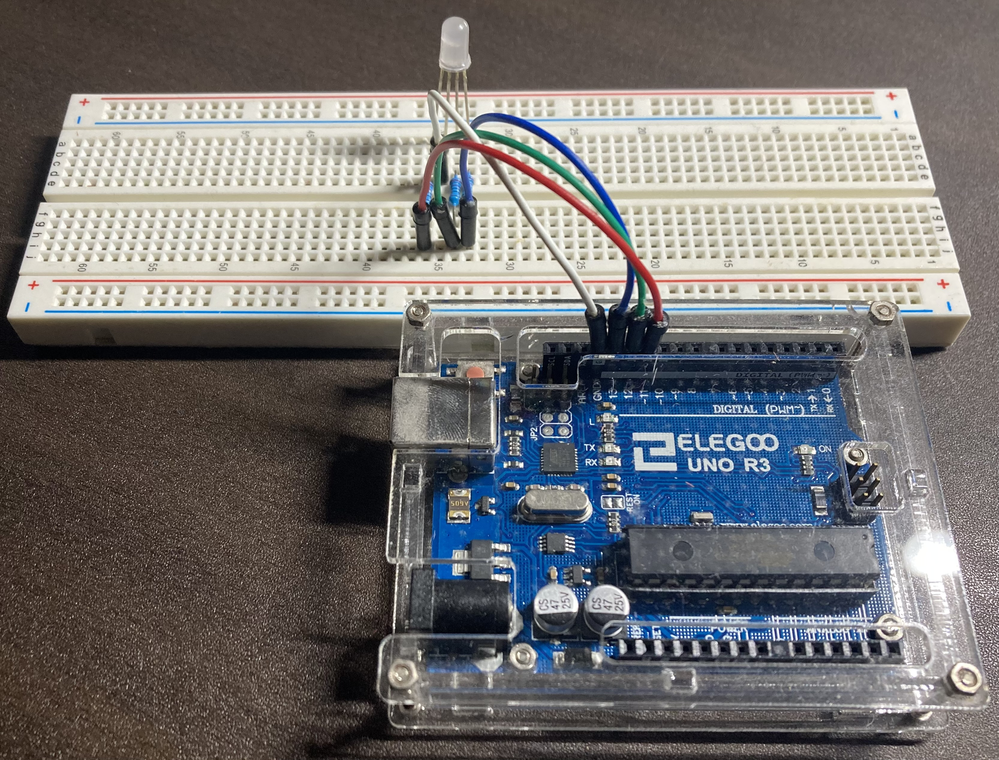

# SoftPWM_RGB
## This library provides the way to use RGB_LED with SoftPWM.

# Installation
1. Put [softPWM](https://github.com/bhagman/SoftPWM) and [SoftPWM_RGB](https://github.com/kouki-0926/SoftPWM_RGB) in C:\Users\\[username]\AppData\Local\Arduino15\libraries
1. Wire as shown in the following picture.

   

# Contributors
- [kouki-0926](https://github.com/kouki-0926)
